# 💳 Digital Banking App

Application bancaire digitale complète développée avec **Spring Boot (Backend)** et **Angular (Frontend)**. Ce projet permet la gestion des clients, des comptes bancaires, des opérations financières (débit, crédit, virement), des bénéficiaires ainsi qu’un tableau de bord statistique.

> 📌 Projet académique réalisé dans le cadre d’un TP / Mini‑projet en **génie informatique / systèmes bancaires**.

---

## 🧱 Architecture du projet

```
Digital-Banking-App/
├── ebanking-backend/        # Backend Spring Boot (REST API)
├── digital-banking-web/     # Frontend Angular
└── README.md
```

Architecture **Client – Serveur** basée sur des **API REST sécurisées**.

---

## 🛠️ Technologies utilisées

### 🔹 Backend

* Java 17+
* Spring Boot
* Spring Data JPA
* Spring Security ( JWT – Scopes USER / ADMIN)
* Hibernate
* Lombok
* Maven
* Base de données : MySQL

### 🔹 Frontend

* Angular
* TypeScript
* HTML / CSS
* Bootstrap

---

## 🔐 Sécurité

* Authentification et autorisation via **Spring Security**
* Gestion des rôles :

  * `SCOPE_USER`
  * `SCOPE_ADMIN`
* Protection des endpoints sensibles avec `@PreAuthorize`

---

## 📦 Fonctionnalités principales

### 👤 Gestion des clients

📸 **Aperçu (screenshots)**


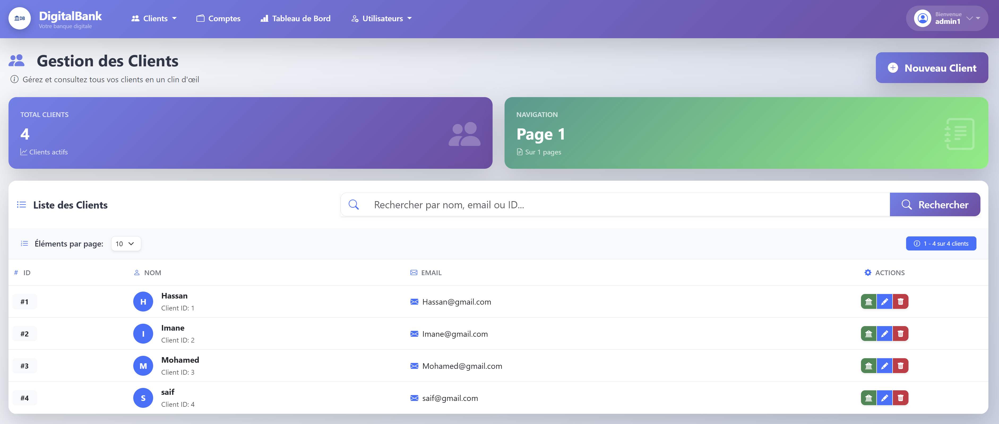
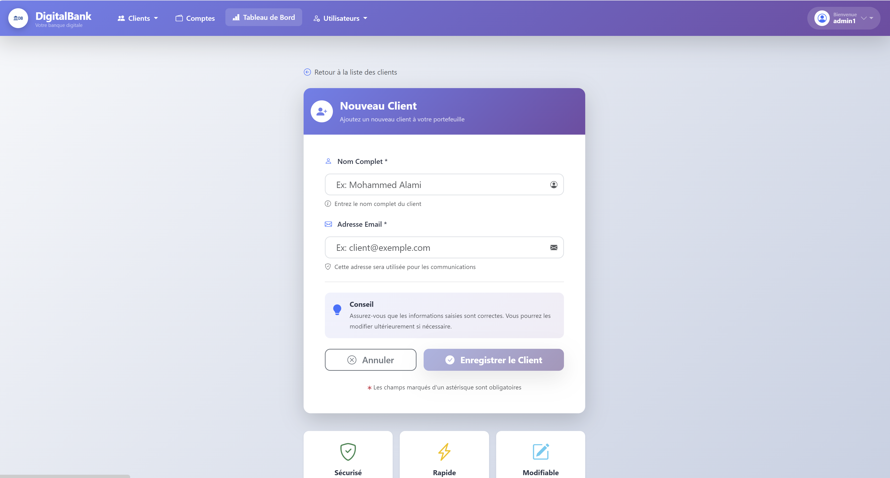
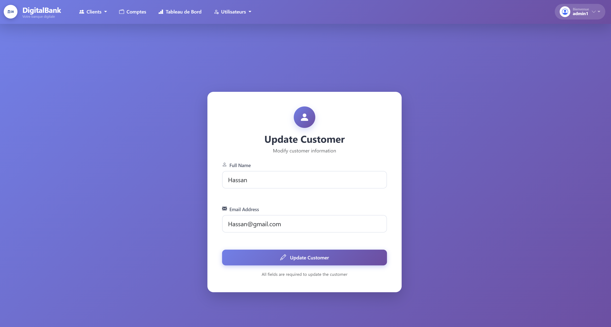


Fonctionnalités :

* Créer, modifier, supprimer un client
* Recherche par mot-clé
* Pagination
* Consulter les comptes d’un client

---

### 💳 Gestion des comptes bancaires

📸 **Aperçu (screenshots)**

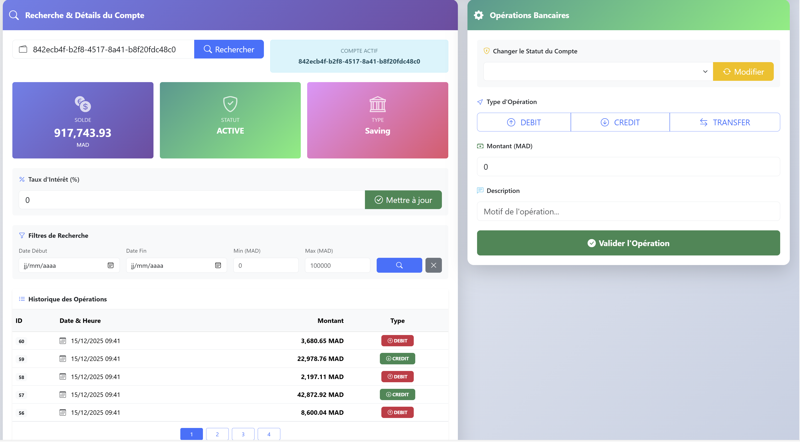
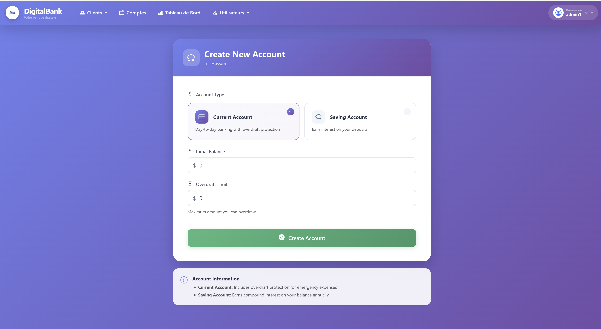
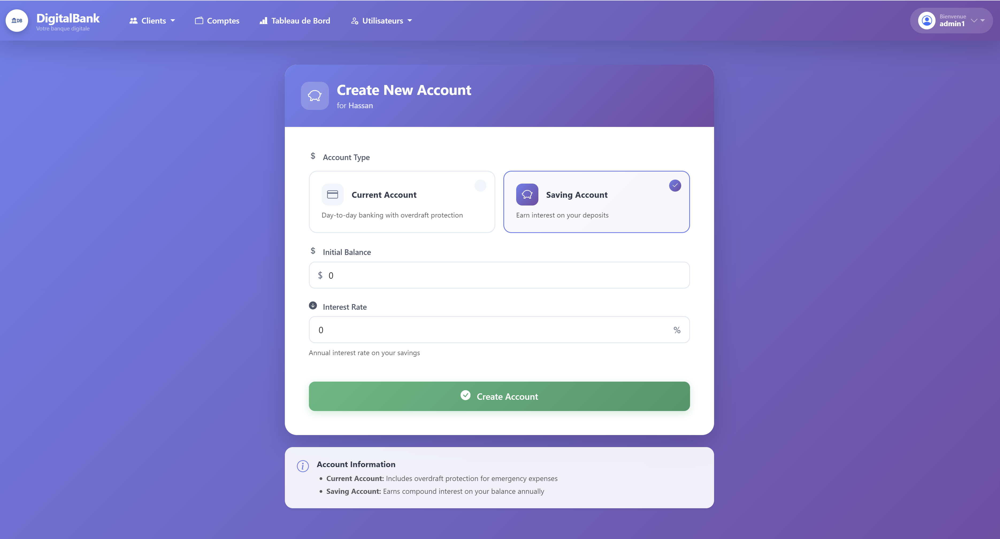


Fonctionnalités :

* Création de comptes :

  * Compte courant
  * Compte épargne
* Consultation des comptes
* Historique des opérations
* Recherche avancée des opérations (date, montant, pagination)
* Mise à jour :

  * Taux d’intérêt
  * Découvert autorisé
  * Statut du compte (ACTIVE, SUSPENDED, etc.)

---

### 💰 Opérations bancaires

📸 **Aperçu (screenshots)**

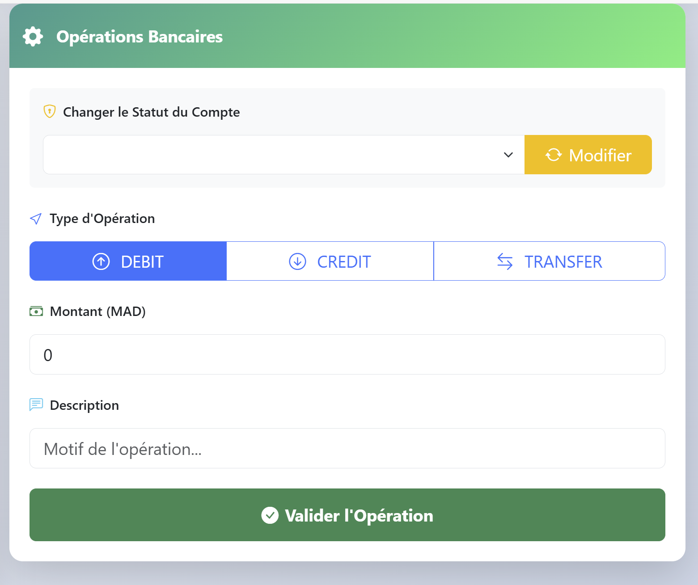
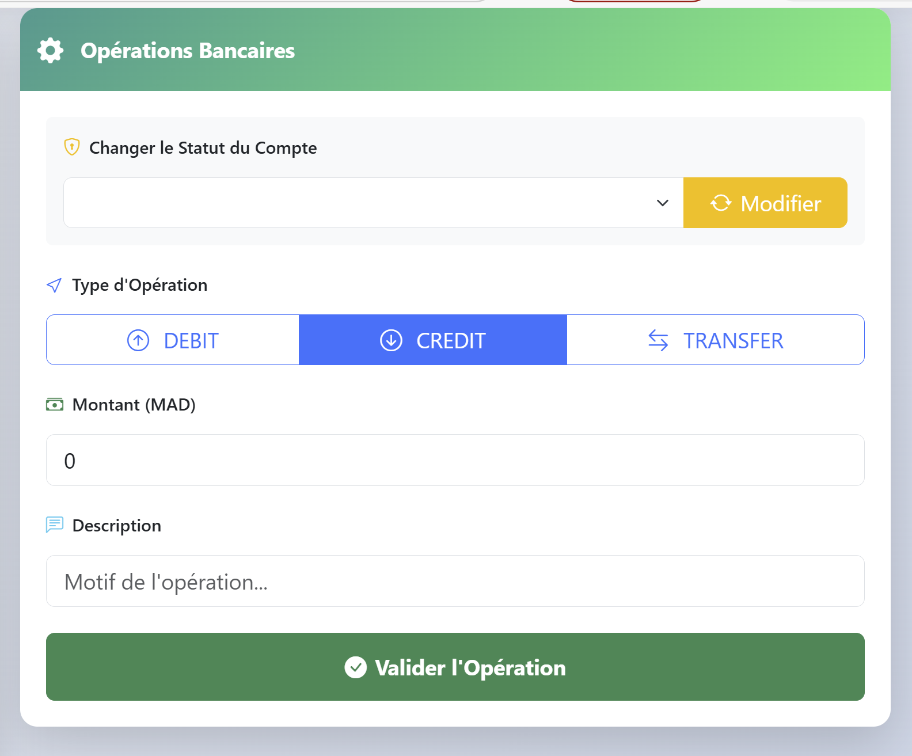
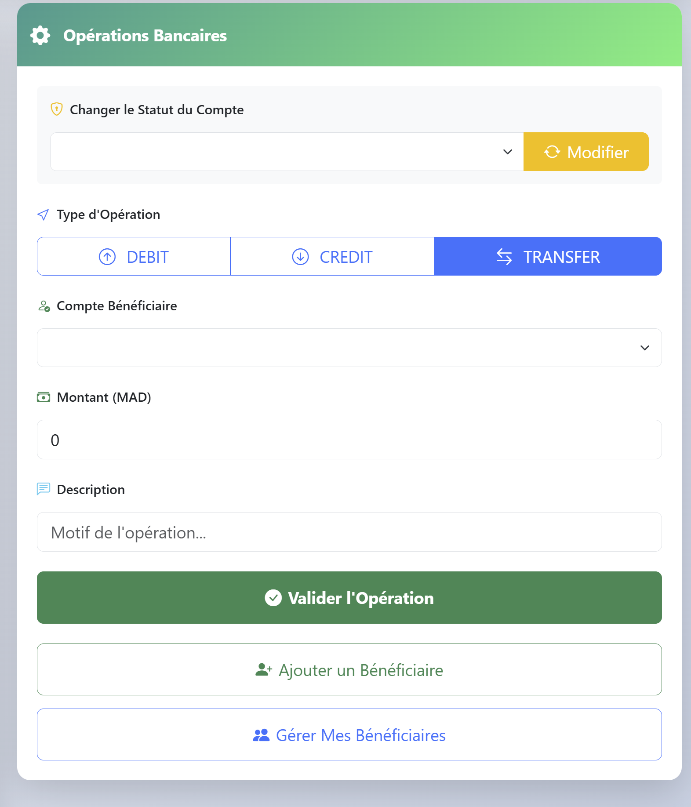


Fonctionnalités :

* Débit
* Crédit
* Virement entre comptes

---

### 👥 Gestion des bénéficiaires

📸 **Aperçu (screenshots)**

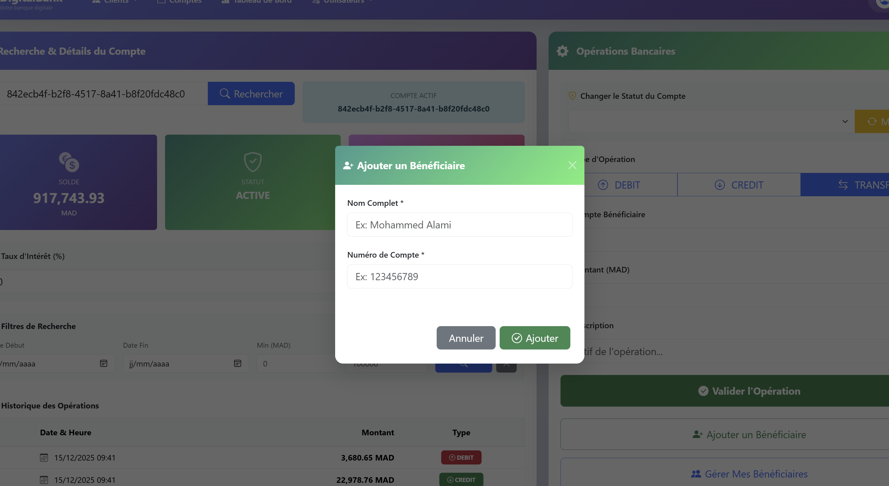
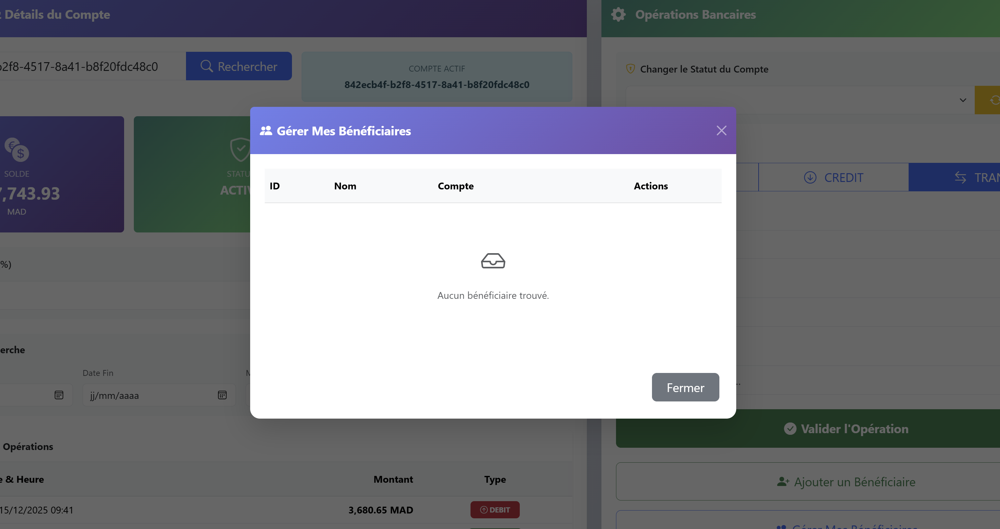
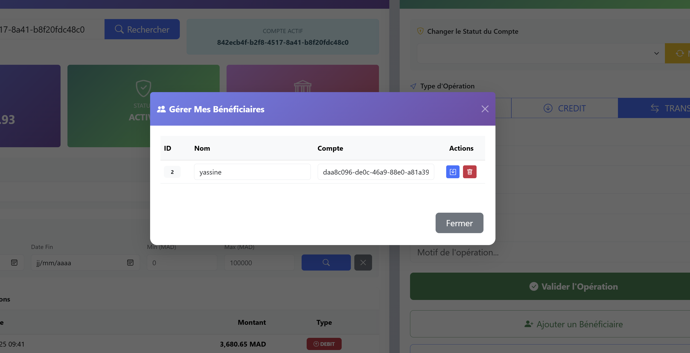


Fonctionnalités :

* Ajouter un bénéficiaire
* Modifier un bénéficiaire
* Supprimer un bénéficiaire
* Lister les bénéficiaires d’un compte

---

### 📊 Dashboard

📸 **Aperçu (screenshots)**
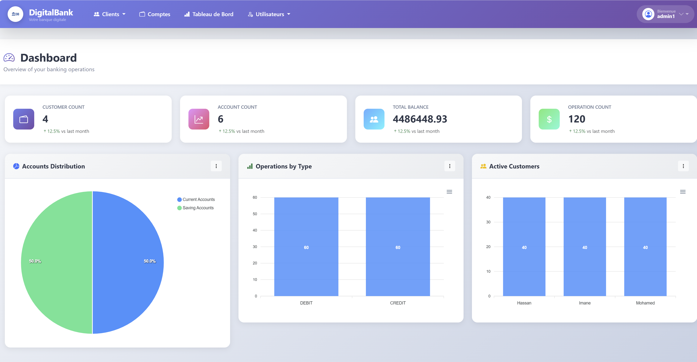


Fonctionnalités :

* Statistiques globales
* Répartition des opérations par type
* Clients les plus actifs

---

### 👨‍💼 Gestion des utilisateurs

📸 **Aperçu (screenshots)**

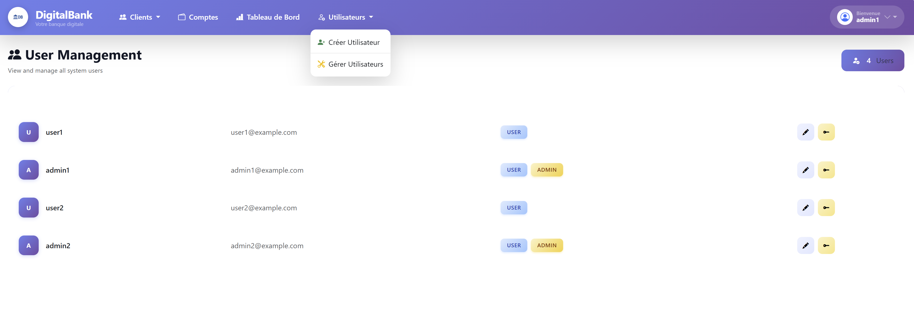
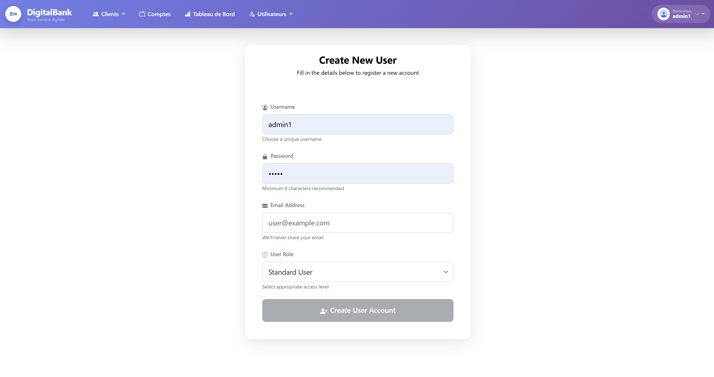
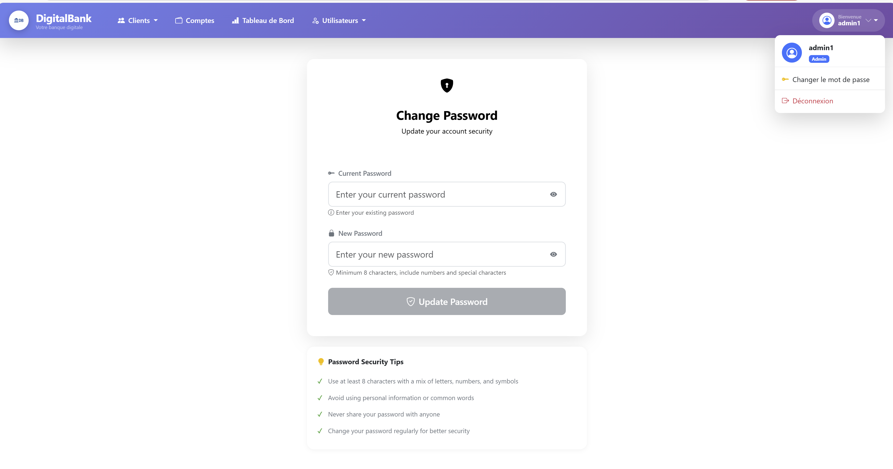
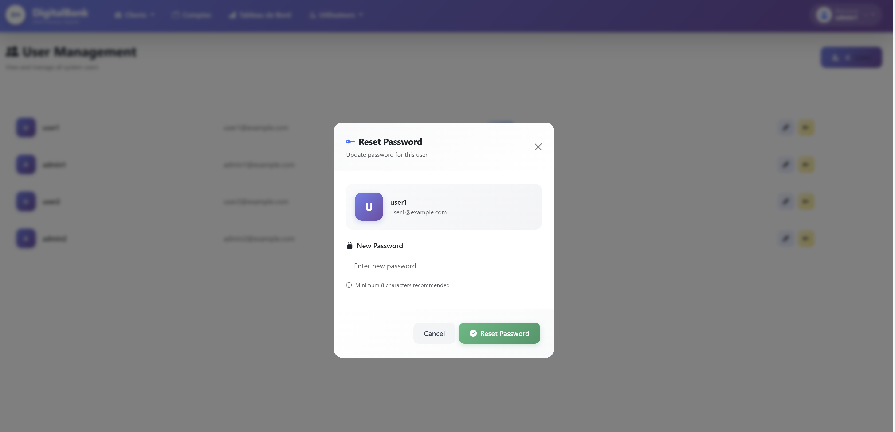


Fonctionnalités :

* Création d’utilisateur
* Mise à jour
* Suppression
* Changement de mot de passe
* Réinitialisation du mot de passe par l’admin

---

## 🔌 API REST – Exemples d’endpoints

### 🔹 Comptes bancaires

```
GET    /accounts
GET    /accounts/{id}
POST   /accounts/createAccount
POST   /accounts/debit
POST   /accounts/credit
POST   /accounts/transfer
PATCH  /accounts/{id}/status
```

### 🔹 Clients

```
GET    /customers
GET    /customers/{id}
POST   /customers
PUT    /customers/{id}
DELETE /customers/{id}
```

### 🔹 Bénéficiaires

```
POST   /accounts/{id}/addBeneficaire
GET    /accounts/{id}/beneficaires
PUT    /accounts/{id}/updateBeneficaire
DELETE /accounts/{accountId}/beneficiaires/{benefId}
```

### 🔹 Dashboard

```
GET /api/dashboard
GET /api/dashboard/operationsByType
GET /api/dashboard/most-active-customers
```

---

## 🚀 Installation et exécution

### 🔹 Backend

```bash
cd ebanking-backend
mvn clean install
mvn spring-boot:run
```

Backend disponible sur :

```
http://localhost:8080
```

### 🔹 Frontend

```bash
cd digital-banking-web
npm install
ng serve
```

Frontend disponible sur :

```
http://localhost:4200
```

---

## 🧪 Tests

```bash
mvn test
```

---

## 🎓 Contexte académique

* Domaine : Génie Informatique / Développement Full Stack
* Thème : Système bancaire digital
* Concepts appliqués :

  * REST API
  * Sécurité
  * Architecture multi‑couches
  * Transactions financières

---

## 👨‍💻 Auteur

**Saif Dine Hassidou**
Ingénieur logiciel / Développeur Full Stack
GitHub : [https://github.com/ssifdine](https://github.com/ssifdine)

---

## 📜 Licence

Projet à but pédagogique – libre d’utilisation pour l’apprentissage.
